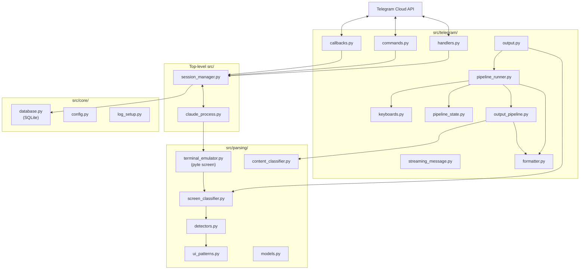
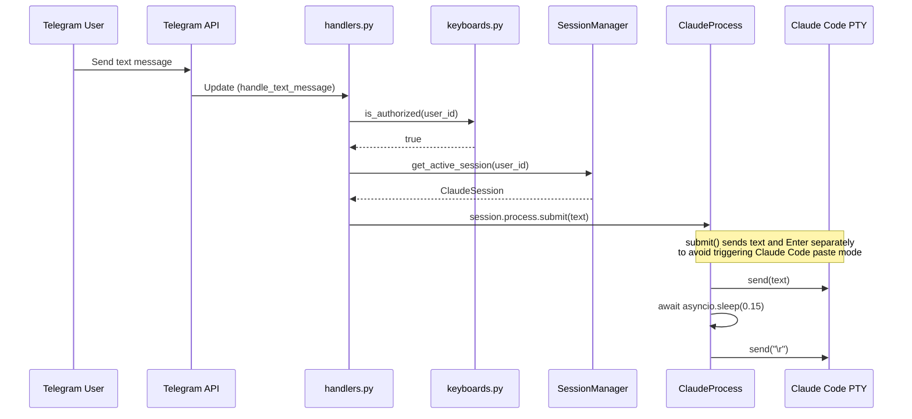
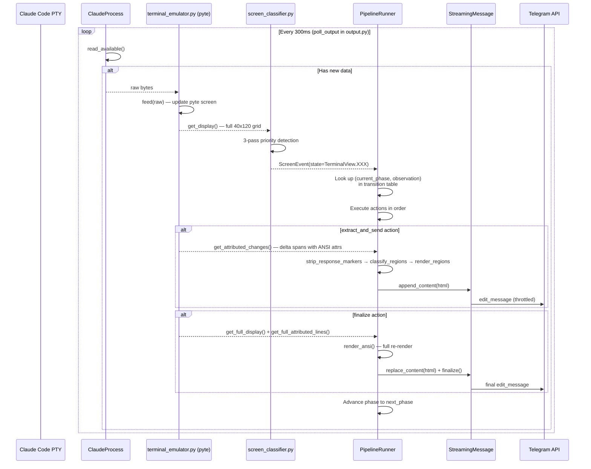
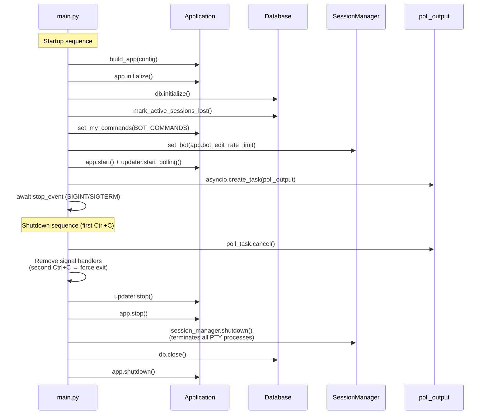

# Architecture

## High-Level Overview



User messages flow left to right: Telegram -> bot handlers -> session manager -> Claude CLI process.
Responses flow right to left: PTY output -> pyte terminal -> screen classifier -> PipelineRunner -> StreamingMessage -> Telegram.

## Module Responsibilities

| Module | Purpose |
|---|---|
| `src/main.py` | Application wiring, startup, signal handling, and entry point |
| **src/telegram/** | |
| `src/telegram/handlers.py` | Core Telegram handlers: `/start`, `/sessions`, `/exit`, text messages, unknown commands |
| `src/telegram/callbacks.py` | Inline keyboard callback query dispatch by prefix (`project:`, `switch:`, `kill:`, `update:`, `tool:`, `page:`) |
| `src/telegram/commands.py` | Extended command handlers: `/history`, `/git`, `/context`, `/download`, `/update_claude`, file uploads |
| `src/telegram/keyboards.py` | Authorization gate, `BOT_COMMANDS` list, inline keyboard builders, history formatting |
| `src/telegram/output.py` | `poll_output()` thin async loop — reads PTY, classifies screen, dispatches to `PipelineRunner` |
| `src/telegram/pipeline_runner.py` | Transition-table-driven event processor: `(PipelinePhase, TerminalView) → (next_phase, actions)` |
| `src/telegram/pipeline_state.py` | `PipelinePhase` enum (4 values), `PipelineState` per-session state, `mark_tool_acted`/`is_tool_request_pending` helpers |
| `src/telegram/output_pipeline.py` | Span manipulation utilities, `render_ansi` ANSI-aware rendering pipeline, `strip_response_markers` |
| `src/telegram/streaming_message.py` | `StreamingMessage` edit-in-place Telegram message with rate limiting, overflow handling |
| `src/telegram/formatter.py` | HTML formatting (`format_html`), text reflowing (`reflow_text`), region rendering (`render_regions`), message splitting for 4096-char limit |
| **src/parsing/** | |
| `src/parsing/terminal_emulator.py` | pyte-based virtual terminal; `get_display()` (full screen), `get_attributed_changes()` (incremental delta with ANSI attributes) |
| `src/parsing/ui_patterns.py` | Compiled regex patterns, `classify_text_line()` for 15 line types, `CHROME_CATEGORIES` constant |
| `src/parsing/models.py` | Shared data types: `TerminalView` enum (14 observations), `ScreenEvent` dataclass |
| `src/parsing/content_classifier.py` | ANSI-aware semantic region classifier using pyte character attributes; produces `ContentRegion` objects |
| `src/parsing/detectors.py` | Structured detectors for tool requests, TODO lists, parallel agents, thinking, background tasks |
| `src/parsing/screen_classifier.py` | `classify_screen_state()` — 3-pass priority classifier returning a `ScreenEvent` |
| **src/core/** | |
| `src/core/config.py` | YAML config loading and validation with typed dataclasses |
| `src/core/database.py` | Async SQLite wrapper for persisting session records |
| `src/core/log_setup.py` | Custom TRACE level (5), console/file handler setup |
| **Top-level src/** | |
| `src/session_manager.py` | Per-user session lifecycle management; owns `PipelineState` per session |
| `src/claude_process.py` | Async wrapper around pexpect-managed Claude Code CLI subprocess |
| `src/project_scanner.py` | Project discovery by scanning for `.git`/`.claude` directories |
| `src/git_info.py` | Git branch and GitHub PR metadata retrieval |
| `src/file_handler.py` | File upload directory management and cleanup |

## Input Path: Telegram to Claude

When a user sends a message, it flows through three layers before reaching Claude Code's PTY:



**Key implementation detail:** Claude Code's TUI detects text + Enter arriving
together as a clipboard paste. The `submit()` method sends them separately with
a 0.15 second delay so the TUI treats it as typed input followed by submit.

## Output Path: Claude to Telegram

Claude Code's responses follow an asynchronous pipeline from PTY bytes to
Telegram messages. A background loop (`poll_output`) polls every 300ms:



**Two separate read patterns from the emulator:**
1. `get_display()` returns the full 40x120 screen for state classification (the classifier needs spatial context to detect screen-wide patterns like tool approval menus)
2. `get_attributed_changes()` returns only lines that changed since last read, **with ANSI color attributes** — used for incremental content extraction and rendering. This avoids re-sending the entire screen every cycle.

**Finalize re-render:** When a response completes (STREAMING → IDLE), the pipeline does a full re-render from the complete screen via `render_ansi()`. This corrects any artifacts from incremental streaming (e.g., partial code blocks, missed formatting) and produces the final clean message.

## Terminal Observation and Pipeline Phase

The output path uses two complementary enums:

**`TerminalView`** (14 values, `src/parsing/models.py`) — pure observation of what the terminal screen looks like right now. One observation is produced per poll cycle by `classify_screen_state()`.

**`PipelinePhase`** (4 values, `src/telegram/pipeline_state.py`) — behavioral state of the bot for one session:
- **DORMANT** — idle, no pending Telegram message
- **THINKING** — "Thinking..." placeholder sent, typing indicator active
- **STREAMING** — content flowing, editing message in place
- **TOOL_PENDING** — tool approval keyboard sent, waiting for user action

The `PipelineRunner` transition table maps every `(PipelinePhase, TerminalView)` pair to a `(next_phase, actions)` tuple. Actions are method name suffixes dispatched in order:

| Action | What it does |
|--------|-------------|
| `send_thinking` | Start typing indicator, send "Thinking..." placeholder |
| `extract_and_send` | Get attributed delta, strip markers, classify regions, render HTML, append to streaming message |
| `finalize` | Full re-render from complete screen, finalize streaming message |
| `send_keyboard` | Build and send tool approval inline keyboard |
| `send_auth_warning` | Send auth warning, kill session (one-shot guard) |

Per-action error isolation: each action is wrapped in `try/except` so partial failures don't prevent subsequent actions from executing. The phase always advances after all actions complete.

### Key transitions

| From | Observation | To | Actions | Why |
|------|-------------|-----|---------|-----|
| DORMANT | THINKING | THINKING | send_thinking | Claude started processing |
| DORMANT | STREAMING | STREAMING | extract_and_send | Immediate content (no thinking phase) |
| THINKING | STREAMING | STREAMING | extract_and_send | Response content appeared |
| THINKING | IDLE | DORMANT | extract_and_send, finalize | Fast response within one poll cycle |
| STREAMING | IDLE | DORMANT | finalize | Response complete |
| STREAMING | TOOL_REQUEST | TOOL_PENDING | finalize, send_keyboard | Tool needs approval |
| STREAMING | THINKING | THINKING | finalize, send_thinking | Claude paused to think mid-response |
| TOOL_PENDING | TOOL_RUNNING | STREAMING | *(none)* | User approved, tool executing |

## Screen Classifier

The classifier recognizes 14 distinct terminal observations. The `PipelineRunner`
determines what to do with each observation based on the current `PipelinePhase`.

```mermaid
stateDiagram-v2
    direction LR

    [*] --> STARTUP: Process spawned

    STARTUP --> IDLE: Prompt appears<br/>(❯ between separators)

    IDLE --> USER_MESSAGE: User types text
    USER_MESSAGE --> THINKING: Claude starts processing

    THINKING --> STREAMING: Response begins<br/>(⏺ marker appears)

    STREAMING --> IDLE: Response complete<br/>(prompt returns)
    STREAMING --> TOOL_REQUEST: Needs approval<br/>(selection menu)
    STREAMING --> THINKING: Pauses to think

    TOOL_REQUEST --> TOOL_RUNNING: User approves
    TOOL_RUNNING --> TOOL_RESULT: Tool completes
    TOOL_RESULT --> STREAMING: Continues response
    TOOL_RESULT --> THINKING: Thinks about result

    STREAMING --> TODO_LIST: Shows task list
    STREAMING --> PARALLEL_AGENTS: Launches agents
    STREAMING --> BACKGROUND_TASK: Background work

    state "Content-bearing (trigger extract_and_send)" as content {
        STREAMING
        ERROR
        TODO_LIST
        PARALLEL_AGENTS
        BACKGROUND_TASK
        TOOL_RUNNING
        TOOL_RESULT
    }

    state "Suppressed (no actions from DORMANT)" as suppressed {
        STARTUP
        IDLE
        USER_MESSAGE
        UNKNOWN
    }

    note right of THINKING
        Sends "Thinking..." once
        on transition to THINKING phase
    end note

    note right of TOOL_REQUEST
        Sends inline keyboard once
        on transition to TOOL_PENDING phase
    end note

    note right of AUTH_REQUIRED
        Sends auth warning once
        (one-shot guard), kills session
    end note
```

### Classifier Priority Order

The classifier uses a 3-pass priority system to resolve ambiguity when multiple
patterns are present on screen simultaneously:

| Pass | Step | Observation | Detection Method |
|------|------|-------------|-----------------|
| 1 (screen-wide) | 1 | TOOL_REQUEST | Selection menu with ❯ cursor + numbered options |
| 1 | 1b | AUTH_REQUIRED | Login/auth prompt patterns |
| 1 | 2 | TODO_LIST | Task count header + checkbox items |
| 1 | 3 | PARALLEL_AGENTS | Agent launch count + tree items |
| 2 (bottom-up) | 4 | THINKING | Star character + ellipsis in bottom 8 lines |
| 2 | 5 | TOOL_RUNNING | "Running..." or "Waiting..." status |
| 2 | 6 | TOOL_RESULT | "Added N lines, removed M lines" diff summary |
| 2 | 7 | BACKGROUND_TASK | "in the background" text |
| 3 (last line) | 8 | IDLE | ❯ between separator lines (3-line gap tolerance) |
| 3 | 9 | STREAMING | ⏺ response marker anywhere on screen |
| 3 | 10 | USER_MESSAGE | ❯ with text, not between separators |
| fallback | 11 | STARTUP | Logo/version in first 10 lines (only if no ⏺ visible) |
| fallback | 12 | ERROR | Error keywords (MCP, ENOENT, etc.) |
| fallback | 13 | UNKNOWN | Nothing matched |

**pyte banner persistence:** The Claude Code startup banner (logo + version)
stays at the top of pyte's screen buffer permanently because the TUI redraws
in-place rather than scrolling. Step 11 guards against this by skipping STARTUP
when a `⏺` response marker exists anywhere on screen.

## Content Extraction and Rendering

Content extraction uses the ANSI-aware pipeline rather than plain-text filtering.
The pipeline operates on `CharSpan` objects from the pyte terminal emulator, which
carry text along with foreground color, bold, and italic attributes.

### Streaming extraction (incremental)

During streaming, `_extract_and_send` in `PipelineRunner`:
1. Calls `emulator.get_attributed_changes()` — returns only lines changed since last read, as `list[list[CharSpan]]`
2. `strip_response_markers()` — filters terminal chrome lines and strips `⏺`/`⎿` markers using `classify_text_line()`
3. `classify_regions()` — groups spans into semantic regions (code blocks, prose, headings, lists) using ANSI color attributes
4. `render_regions()` → `reflow_text()` → `format_html()` — produces Telegram HTML

### Full re-render (finalize)

When a response completes, `_finalize` does a full re-render:
1. Calls `emulator.get_full_display()` and `get_full_attributed_lines()` — complete screen
2. `filter_response_attr()` — filters to response content only, strips prompt lines and chrome
3. `classify_regions()` → `render_regions()` → `reflow_text()` → `format_html()`
4. Replaces the streaming message content with the clean final render

### Line classification

`classify_text_line()` in `src/parsing/ui_patterns.py` recognizes 15 line types:

| Kept (sent to user) | Stripped (UI chrome) |
|---------------------|---------------------|
| `content` — plain text | `separator` — ─━═ lines |
| `response` — ⏺ prefix stripped | `status_bar` — project/branch/usage |
| `tool_connector` — ⎿ prefix stripped | `thinking` — star + ellipsis |
| | `tool_header` — Bash()/Write()/Read() |
| | `prompt` — ❯ input line |
| | `box` — ╭╮╰╯ box-drawing |
| | `logo` — ▐▛▜▌ block elements |
| | `empty` — blank lines |
| | `diff_delimiter` — ╌ lines |
| | `todo_item` — ◻◼✔ checkboxes |
| | `agent_tree` — ├└─ tree items |
| | `startup` — Claude Code version banner |

## Startup & Shutdown



**Why `_on_startup()` is called directly:** The python-telegram-bot `post_init`
callback only fires with `run_polling()` or `run_webhook()`. This application
uses manual startup (`initialize()` + `start()` + `updater.start_polling()`)
for signal handling control, so `_on_startup()` must be called explicitly.

**`set_bot()` wiring:** `session_manager.set_bot(bot, edit_rate_limit)` is called
during startup so that sessions created later automatically get a `PipelineState`
(with terminal emulator + streaming message). Without this call, sessions have
`pipeline=None` and output streaming is disabled.

## Key Design Decisions

### 1. Transition-Table-Driven Pipeline

The output pipeline uses a single `(PipelinePhase, TerminalView) → (next_phase, actions)` transition table in `src/telegram/pipeline_runner.py`. This replaces an earlier design with three interacting state machines.

Benefits:
- **All behavior is visible in one table** — no hidden interactions between state machines.
- **Adding new observations** (e.g., a new Claude Code UI element) requires adding one row per phase to the table.
- **Import-time validation** ensures every action string in the table maps to a real method on `PipelineRunner`.
- **Per-action error isolation** — each action is wrapped in try/except, so partial failures don't block subsequent actions or prevent phase advancement.

### 2. TerminalView Classifier

The parser uses a 14-value `TerminalView` enum (`src/parsing/models.py`) to classify the full terminal screen rather than reacting to individual lines. Classification runs a 3-pass priority detection in `classify_screen_state()` (`src/parsing/screen_classifier.py`):

- **Pass 1 (screen-wide):** tool approval menus, auth screens, TODO lists, parallel agents.
- **Pass 2 (bottom-up):** thinking indicators, running tools, tool results, background tasks.
- **Pass 3 (last line + fallback):** idle prompt, streaming, user message, startup, error, unknown.

Five dedicated detector functions in `src/parsing/detectors.py` feed into `classify_screen_state()`, which returns a `ScreenEvent` used by the `PipelineRunner` transition table.

### 3. Capture-Driven Parsing

Every parser change is validated against a corpus of real terminal snapshots captured from live Claude Code sessions using `scripts/capture_claude_ui.py`. This ensures:

- Zero UNKNOWN classifications across all captured states.
- Regressions from pyte rendering artifacts (e.g., trailing U+FFFD on separator lines) are caught immediately.
- New Claude Code UI patterns are added to the test corpus before parser code is modified.

### 4. Tool Approval Forwarding

All tool approval prompts detected by the screen state classifier are forwarded to the Telegram user as interactive inline keyboards (built by `src/telegram/keyboards.py`). The bot never auto-approves any tool use. This gives the human operator full control over file writes, command execution, and other side-effecting actions initiated by Claude Code.

### 5. pyte Terminal Emulator

Instead of regex-stripping ANSI escape sequences from raw PTY output, `src/parsing/terminal_emulator.py` feeds bytes into a real virtual terminal emulator (`pyte.Screen`). This approach:

- Correctly handles cursor movement, screen redraws, and partial overwrites that Claude Code's TUI produces.
- Provides a stable 2D character grid to read from, eliminating an entire class of escape-sequence parsing bugs.
- Preserves ANSI color attributes on each character, which the content classifier uses to distinguish code blocks from prose.
- Trades some performance for correctness — the pyte screen is the single source of truth for what the user would see in a real terminal.

### 6. Dual-Read Pattern

The output pipeline uses two separate reads from the terminal emulator each cycle:

- `get_display()` returns the full 40x120 screen for state classification (the classifier needs full spatial context to detect screen-wide patterns like tool approval menus).
- `get_attributed_changes()` returns only lines that changed since the last read, **with ANSI attributes** — used for incremental content extraction. This prevents re-sending the entire visible screen every 300ms.

This separation is critical: classification needs the full picture, but content extraction must be incremental to avoid duplicate messages in Telegram.
