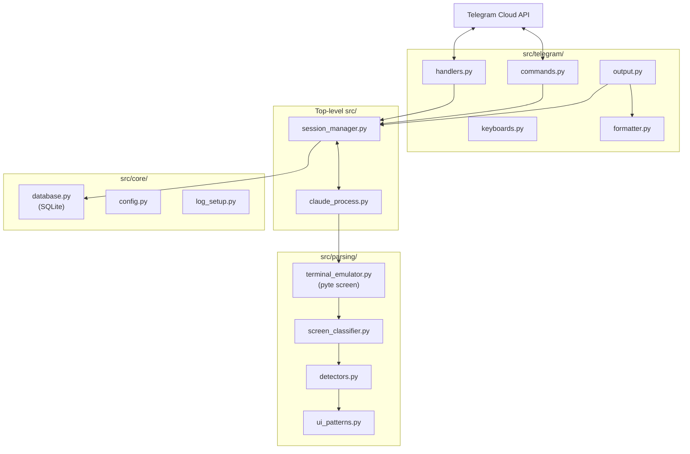
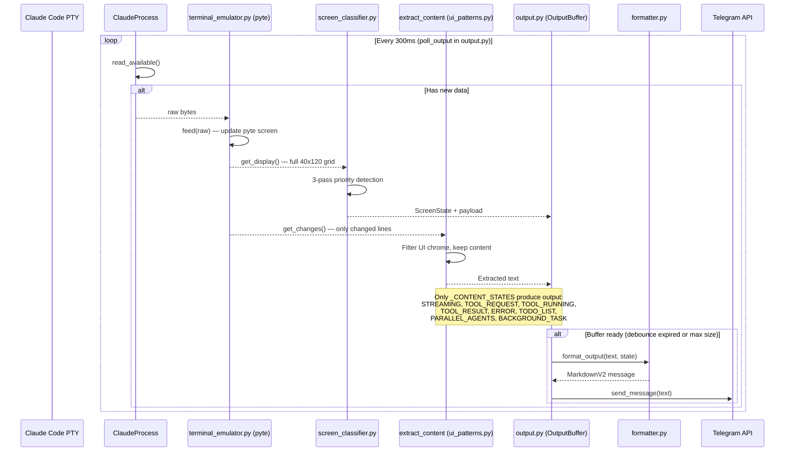

# Architecture

## High-Level Overview

User messages flow left to right: Telegram -> bot handlers -> session manager -> Claude CLI process.
Responses flow right to left: PTY output -> pyte terminal -> parser/classifier -> Telegram message.

## Module Responsibilities

| Module | Purpose |
|---|---|
| `src/main.py` | Application wiring, startup, signal handling, and entry point |
| **src/telegram/** | |
| `src/telegram/handlers.py` | Core Telegram handlers: `/start`, `/sessions`, `/exit`, text messages, callback queries |
| `src/telegram/commands.py` | Extended command handlers: `/history`, `/git`, `/context`, `/download`, `/update_claude`, file uploads |
| `src/telegram/keyboards.py` | Authorization gate, `BOT_COMMANDS` list, inline keyboard builders, history formatting |
| `src/telegram/output.py` | `poll_output()` async loop -- polls sessions, classifies state, streams to Telegram |
| `src/telegram/formatter.py` | Telegram MarkdownV2 escaping, message splitting, screen state rendering |
| **src/parsing/** | |
| `src/parsing/terminal_emulator.py` | pyte-based virtual terminal; `get_display()` (full screen) and `get_changes()` (delta) |
| `src/parsing/ui_patterns.py` | `ScreenState` enum (13 states), compiled regex patterns, `classify_line()` for 14 line types |
| `src/parsing/detectors.py` | Structured detectors for tool requests, TODO lists, parallel agents, thinking, background tasks |
| `src/parsing/screen_classifier.py` | `classify_screen_state()` -- 3-pass priority classifier returning a single `ScreenState` |
| **src/core/** | |
| `src/core/config.py` | YAML config loading and validation with typed dataclasses |
| `src/core/database.py` | Async SQLite wrapper for persisting session records |
| `src/core/log_setup.py` | Custom TRACE level (5), console/file handler setup |
| **Top-level src/** | |
| `src/session_manager.py` | Per-user session lifecycle management and output buffering |
| `src/claude_process.py` | Async wrapper around pexpect-managed Claude Code CLI subprocess |
| `src/project_scanner.py` | Project discovery by scanning for `.git`/`.claude` directories |
| `src/git_info.py` | Git branch and GitHub PR metadata retrieval |
| `src/file_handler.py` | File upload directory management and cleanup |

## Input Path: Telegram to Claude

When a user sends a message, it flows through three layers before reaching Claude Code's PTY:

**Key implementation detail:** Claude Code's TUI detects text + Enter arriving
together as a clipboard paste. The `submit()` method sends them separately with
a 0.15 second delay so the TUI treats it as typed input followed by submit.

## Output Path: Claude to Telegram

Claude Code's responses follow an asynchronous pipeline from PTY bytes to
Telegram messages. A background loop (`poll_output`) polls every 300ms:

**Two separate reads from the emulator per cycle** (in `src/telegram/output.py`):
1. `get_display()` returns the full screen for state classification via `src/parsing/screen_classifier.py` (needs full context)
2. `get_changes()` returns only lines that changed since last read (incremental delta for content extraction via `src/parsing/ui_patterns.py`, avoids re-sending the entire screen every cycle)

## Screen State Machine

The classifier recognizes 13 distinct screen states. States in green produce
content sent to Telegram; states in grey are suppressed (UI chrome, transient).

### Classifier Priority Order

The classifier uses a 3-pass priority system to resolve ambiguity when multiple
patterns are present on screen simultaneously:

| Pass | Step | State | Detection Method |
|------|------|-------|-----------------|
| 1 (screen-wide) | 1 | TOOL_REQUEST | Selection menu with ❯ cursor + numbered options |
| 1 | 2 | TODO_LIST | Task count header + checkbox items |
| 1 | 3 | PARALLEL_AGENTS | Agent launch count + tree items |
| 2 (bottom-up) | 4 | THINKING | Star character + ellipsis in bottom 8 lines |
| 2 | 5 | TOOL_RUNNING | "Running..." or "Waiting..." status |
| 2 | 6 | TOOL_RESULT | "Added N lines, removed M lines" diff summary |
| 2 | 7 | BACKGROUND_TASK | "in the background" text |
| 3 (last line) | 8 | IDLE | ❯ between separator lines (3-line gap tolerance) |
| 3 | 9 | STREAMING | ⏺ response marker anywhere on screen |
| 3 | 10 | USER_MESSAGE | ❯ with text, not between separators |
| fallback | 11 | STARTUP | Logo/version in first 10 lines (only if no ⏺ visible) |
| fallback | 12 | ERROR | Error keywords (MCP, ENOENT, etc.) |
| fallback | 13 | UNKNOWN | Nothing matched |

**pyte banner persistence:** The Claude Code startup banner (logo + version)
stays at the top of pyte's screen buffer permanently because the TUI redraws
in-place rather than scrolling. Step 11 guards against this by skipping STARTUP
when a `⏺` response marker exists anywhere on screen. The poll loop has an
additional guard that converts STARTUP to UNKNOWN once the session has left
the STARTUP state.

## Content Extraction

`extract_content()` (in `src/parsing/ui_patterns.py`) filters display lines through `classify_line()` which
recognizes 14 line types:

| Kept (sent to user) | Stripped (UI chrome) |
|---------------------|---------------------|
| `content` — plain text | `separator` — ─━═ lines |
| `response` — ⏺ prefix stripped | `status_bar` — project/branch/usage |
| `tool_connector` — ⎿ prefix stripped | `thinking` — star + ellipsis |
| | `tool_header` — Bash()/Write()/Read() |
| | `prompt` — ❯ input line |
| | `box` — ╭╮╰╯ box-drawing |
| | `logo` — ▐▛▜▌ block elements |
| | `empty` — blank lines |
| | `diff_delimiter` — ╌ lines |
| | `todo_item` — ◻◼✔ checkboxes |
| | `agent_tree` — ├└─ tree items |

## Startup & Shutdown

**Why `_on_startup()` is called directly:** The python-telegram-bot `post_init`
callback only fires with `run_polling()` or `run_webhook()`. This application
uses manual startup (`initialize()` + `start()` + `updater.start_polling()`)
for signal handling control, so `_on_startup()` must be called explicitly.

## Key Design Decisions

### 1. ScreenState Classifier

The parser uses a 13-state enum (`ScreenState` in `src/parsing/ui_patterns.py`) to classify the full terminal screen rather than reacting to individual lines. Classification runs a 3-pass priority detection in `classify_screen_state()` (`src/parsing/screen_classifier.py`):

- **Pass 1 (screen-wide):** tool approval menus, TODO lists, parallel agents.
- **Pass 2 (bottom-up):** thinking indicators, running tools, tool results, background tasks.
- **Pass 3 (last line):** idle prompt, streaming, user message, startup, error, unknown.

Five dedicated detector functions in `src/parsing/detectors.py` feed into `classify_screen_state()`, which returns a single authoritative state used by downstream formatting and control logic.

### 2. Capture-Driven Parsing

Every parser change is validated against a corpus of real terminal snapshots captured from live Claude Code sessions using `scripts/capture_claude_ui.py`. This ensures:

- Zero UNKNOWN classifications across all captured states.
- Regressions from pyte rendering artifacts (e.g., trailing U+FFFD on separator lines) are caught immediately.
- New Claude Code UI patterns are added to the test corpus before parser code is modified.

### 3. Tool Approval Forwarding

All tool approval prompts detected by the screen state classifier (`src/parsing/screen_classifier.py`) are forwarded to the Telegram user as interactive inline keyboards (built by `src/telegram/keyboards.py`). The bot never auto-approves any tool use. This gives the human operator full control over file writes, command execution, and other side-effecting actions initiated by Claude Code.

### 4. pyte Terminal Emulator

Instead of regex-stripping ANSI escape sequences from raw PTY output, `src/parsing/terminal_emulator.py` feeds bytes into a real virtual terminal emulator (`pyte.Screen`). This approach:

- Correctly handles cursor movement, screen redraws, and partial overwrites that Claude Code's TUI produces.
- Provides a stable 2D character grid to read from, eliminating an entire class of escape-sequence parsing bugs.
- Trades some performance for correctness -- the pyte screen is the single source of truth for what the user would see in a real terminal.

### 5. Incremental Content Extraction

The output pipeline (`src/telegram/output.py`) uses two separate reads from the terminal emulator (`src/parsing/terminal_emulator.py`) each cycle:

- `get_display()` returns the full 40x120 screen for state classification via `src/parsing/screen_classifier.py` (the classifier needs full context to detect screen-wide patterns like tool approval menus).
- `get_changes()` returns only lines that changed since the last read, used for content extraction via `src/parsing/ui_patterns.py`. This prevents re-sending the entire visible screen every 300ms.

This separation is critical: classification needs the full picture, but content extraction must be incremental to avoid duplicate messages in Telegram.
