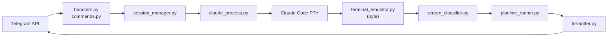

# Documentation Index

## Guides

| Document | Description |
|---|---|
| [Architecture](architecture.md) | System architecture, module responsibilities, sequence diagrams, design decisions |
| [Installation](installation.md) | Setup instructions, dependencies, systemd deployment |
| [Usage](usage.md) | Bot commands, workflows, configuration reference |
| [Claude UI Patterns](claude-ui-patterns.md) | Captured terminal patterns used for parser development and testing |

## Plans

Active plans in [`docs/plans/`](plans/):

| Plan | Description |
|---|---|
| [Project Restructure Design](plans/2026-02-11-project-restructure-design.md) | Sub-package structure design |
| [Project Restructure Plan](plans/2026-02-11-project-restructure-plan.md) | Implementation plan for restructure |
| [PR Documentation Design](plans/2026-02-11-pr-documentation-design.md) | PR and documentation workflow |
| [Debug Trace Logging](plans/2026-02-10-debug-trace-logging.md) | TRACE log level design |
| [Rich Output Streaming Design](plans/2026-02-11-rich-output-streaming-design.md) | HTML streaming output design |
| [Rich Output Streaming Plan](plans/2026-02-11-rich-output-streaming-plan.md) | Implementation plan for streaming |

Archived plans from earlier phases are in [`docs/archive/`](archive/).

## Package READMEs

| Package | Description |
|---|---|
| [src/parsing/README.md](../src/parsing/README.md) | Terminal output parsing pipeline |
| [src/telegram/README.md](../src/telegram/README.md) | Telegram bot layer |
| [src/core/README.md](../src/core/README.md) | Shared infrastructure |

## System Diagram

End-to-end data flow from Telegram user to Claude Code and back:



## Quick Start for Contributors

### Project Structure

```
src/
  parsing/          # PTY bytes -> TerminalView (terminal_emulator, ui_patterns, detectors, screen_classifier)
  telegram/         # Telegram interaction (formatter, keyboards, handlers, commands, output)
  core/             # Shared infra (config, database, log_setup)
  main.py           # Entry point & app wiring
  claude_process.py # pexpect PTY wrapper
  session_manager.py# Session lifecycle & routing
  project_scanner.py# Project discovery
  git_info.py       # Git metadata
  file_handler.py   # Upload management
tests/
  parsing/          # Tests for src/parsing/
  telegram/         # Tests for src/telegram/
  test_main.py      # Tests for main.py
  ...               # Tests for other top-level modules
```

### Running Tests

```bash
# All tests
python -m pytest --tb=short -q

# Single package
python -m pytest tests/parsing/ -v
python -m pytest tests/telegram/ -v

# With coverage
python -m pytest --cov=src --cov-report=term-missing
```

### Running the Bot

```bash
python run.py [config.yaml] [--debug] [--trace] [--verbose]
```
