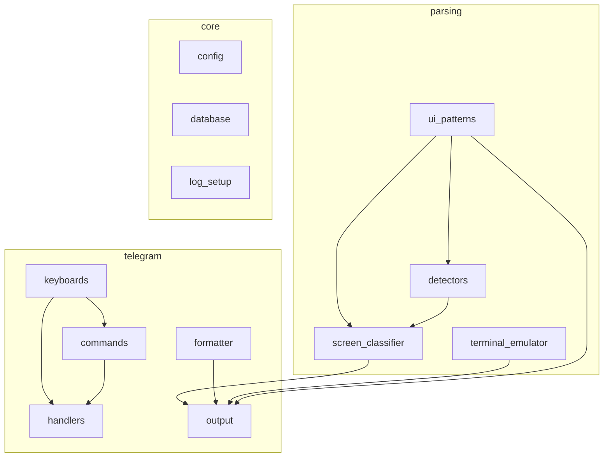

# Project Restructure: Sub-packages, Test Splits & Documentation

**Date**: 2026-02-11
**Status**: Approved
**Prerequisite**: SRP split of `output_parser.py` and `bot.py` into 9 modules (completed)

## Context

After the SRP split, `src/` contains 9 new focused modules alongside existing ones — but all sit flat in a single directory. Test files (`test_output_parser.py`, `test_bot.py`) still test the old monoliths. Documentation references deleted files. This design addresses all three issues.

## Section 1: Sub-package Structure

Group related modules into three sub-packages under `src/`:

```
src/
├── parsing/                    # Terminal → structured data pipeline
│   ├── __init__.py
│   ├── terminal_emulator.py    # pyte wrapper, ANSI stripping, spinner filtering
│   ├── ui_patterns.py          # ScreenState enum, regexes, classify_line, extract_content
│   ├── detectors.py            # Structured extraction (prompts, context, status bar, etc.)
│   └── screen_classifier.py    # Full-screen state classification orchestrator
│
├── telegram/                   # Telegram bot layer
│   ├── __init__.py
│   ├── formatter.py            # format_telegram, split_message (was telegram_format.py)
│   ├── keyboards.py            # UI builders, auth check, BOT_COMMANDS (was bot_keyboards.py)
│   ├── handlers.py             # Session lifecycle, message routing (was bot_handlers.py)
│   ├── commands.py             # Feature commands (was bot_commands.py)
│   └── output.py               # poll_output streaming pipeline (was bot_output.py)
│
├── core/                       # Shared infrastructure
│   ├── __init__.py
│   ├── config.py               # (moved from src/)
│   ├── database.py             # (moved from src/)
│   └── log_setup.py            # (moved from src/)
│
├── main.py                     # Entry point (stays top-level)
├── claude_process.py           # PTY wrapper (stays top-level)
├── session_manager.py          # Session lifecycle (stays top-level)
├── project_scanner.py          # Project discovery (stays top-level)
├── git_info.py                 # Git metadata (stays top-level)
└── file_handler.py             # File upload handling (stays top-level)
```

### Dependency graph (mermaid)



### `__init__.py` philosophy

Each `__init__.py` re-exports the package's public API so consumers can do:
```python
from src.parsing import classify_screen_state, ScreenState
from src.telegram import poll_output, BOT_COMMANDS
from src.core import load_config, Database
```

Internal cross-references within a package use relative imports:
```python
# Inside src/parsing/detectors.py
from .ui_patterns import _SEPARATOR_RE, _PROMPT_RE
```

## Section 2: Test File Reorganization

Mirror source structure in tests:

```
tests/
├── parsing/
│   ├── conftest.py             # Shared fixtures (snapshot helpers, screen builders)
│   ├── test_terminal_emulator.py
│   ├── test_ui_patterns.py
│   ├── test_detectors.py
│   └── test_screen_classifier.py
│
├── telegram/
│   ├── conftest.py             # Shared fixtures (mock update/context factories)
│   ├── test_formatter.py       # (was telegram_format tests in test_output_parser.py)
│   ├── test_keyboards.py
│   ├── test_handlers.py
│   ├── test_commands.py
│   └── test_output.py
│
├── test_config.py              # (stays)
├── test_database.py            # (stays)
├── test_session_manager.py     # (stays)
├── test_claude_process.py      # (stays)
├── test_main.py                # (stays, update imports)
├── test_git_info.py            # (stays)
├── test_file_handler.py        # (stays)
├── test_project_scanner.py     # (stays)
└── conftest.py                 # Root conftest (stays)
```

### Split strategy

- Each test class/group moves to the file matching its source module
- Shared fixtures (e.g., `_make_screen()`, `_make_update()`) go into sub-package `conftest.py`
- All `patch()` targets updated to new module paths (e.g., `"src.telegram.handlers.scan_projects"`)
- Old `test_output_parser.py` and `test_bot.py` deleted after split

## Section 3: Documentation Layer

### CLAUDE.md (project root)

Primary navigation file for Claude Code:
- Project overview (1-2 sentences)
- Architecture diagram (mermaid) showing sub-packages and relationships
- Key conventions: naming, imports, testing patterns
- Quick reference: "where to find X" table mapping concepts to files
- **Directives**: "After every code change, update relevant docstrings, in-code comments, and documentation files. Keep docs/index.md and per-package READMEs accurate."

### Per-package READMEs

`src/parsing/README.md`, `src/telegram/README.md`, `src/core/README.md`:
- Package purpose (1 sentence)
- Module inventory with one-line descriptions
- Internal dependency diagram (mermaid)
- Key patterns specific to that package

### docs/index.md

Documentation hub:
- Links to all docs (architecture, installation, usage, design plans)
- Mermaid diagram of the full system (terminal → parser → classifier → formatter → Telegram)
- Quick-start for contributors

### docs/architecture.md

Update to reflect new module structure (currently references deleted `bot.py` and `output_parser.py`). Replace all diagrams with mermaid.

### docs/archive/

Move old completed plans here to declutter docs root.

### Convenience launcher — `run.py`

```python
#!/usr/bin/env python3
"""Launch the Claude Instance Manager bot."""
import asyncio
from src.main import main
asyncio.run(main())
```

Simple, executable (`chmod +x`), passes CLI args through.

## Section 4: Migration Strategy & Execution Order

The migration must be atomic per phase — tests pass after every step.

### Phase A: Create sub-packages (source only)

1. Create `src/parsing/`, `src/telegram/`, `src/core/` directories with `__init__.py`
2. Move files into sub-packages (`git mv`):
   - `src/terminal_emulator.py` → `src/parsing/terminal_emulator.py`
   - `src/ui_patterns.py` → `src/parsing/ui_patterns.py`
   - `src/detectors.py` → `src/parsing/detectors.py`
   - `src/screen_classifier.py` → `src/parsing/screen_classifier.py`
   - `src/telegram_format.py` → `src/telegram/formatter.py`
   - `src/bot_keyboards.py` → `src/telegram/keyboards.py`
   - `src/bot_handlers.py` → `src/telegram/handlers.py`
   - `src/bot_commands.py` → `src/telegram/commands.py`
   - `src/bot_output.py` → `src/telegram/output.py`
   - `src/config.py` → `src/core/config.py`
   - `src/database.py` → `src/core/database.py`
   - `src/log_setup.py` → `src/core/log_setup.py`
3. Update all internal cross-imports
4. Update `src/main.py` imports
5. Run tests — fix any remaining import paths

### Phase B: Split test files

1. Create `tests/parsing/`, `tests/telegram/` with `conftest.py` where needed
2. Split `test_output_parser.py` into 5 files mirroring `src/parsing/`
3. Split `test_bot.py` into 4 files mirroring `src/telegram/`
4. Update all `patch()` targets to new module paths
5. Run tests — all must pass, delete old test files

### Phase C: Documentation

1. Create `CLAUDE.md`, `docs/index.md`, per-package READMEs
2. Update `docs/architecture.md` with mermaid diagrams
3. Move old plans to `docs/archive/`
4. Create `run.py` launcher

Each phase is a separate commit.

## Verification

- `python -m pytest` — all 401+ tests pass after each phase
- `wc -l src/**/*.py` — all files under 500 lines
- No `from src.output_parser import` or `from src.bot import` remaining
- No `from src.bot_keyboards import` etc. (old flat paths) remaining after Phase A
- All mermaid diagrams render correctly
