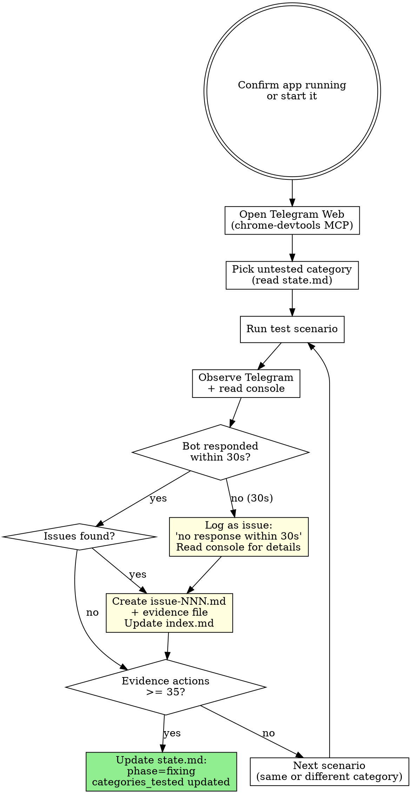
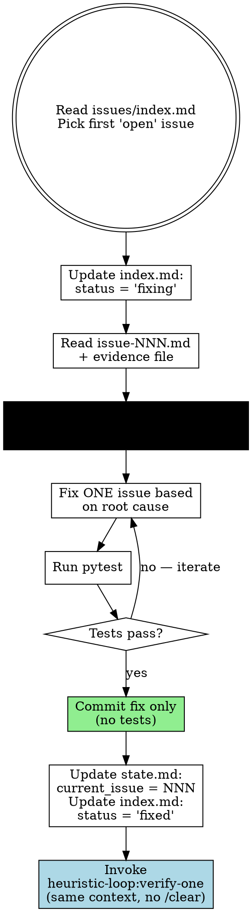
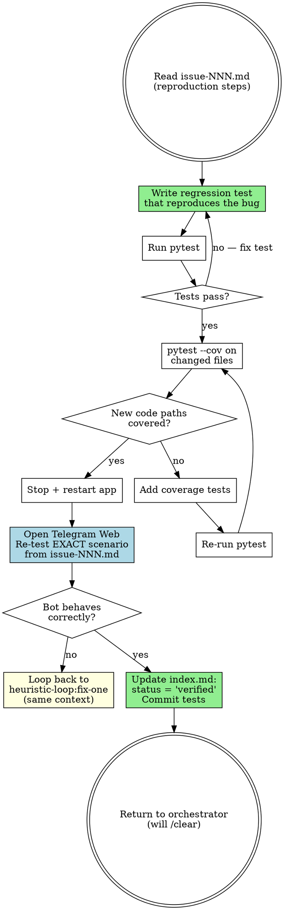

# Heuristic Loop Refactor — Implementation Plan

> **For Claude:** REQUIRED SUB-SKILL: Use superpowers:executing-plans to implement this plan task-by-task.

**Goal:** Split the monolithic 323-line `heuristic-loop` skill into an orchestrator + 3 specialized sub-skills with file-based durable state.

**Architecture:** The orchestrator manages the loop and transitions via state files in `.claude/heuristic-loop-state/`. Three sub-skills handle testing (test-and-gather), fixing (fix-one), and verification (verify-one) independently, each getting their own context window via /clear boundaries.

**Tech Stack:** Claude Code skills (Markdown SKILL.md files), .gitignore

**Design doc:** `docs/plans/2026-02-12-heuristic-loop-refactor-design.md`

---

### Task 1: Add .gitignore entry for heuristic-loop-state

**Files:**
- Modify: `.gitignore`

**Step 1: Add gitignore entry**

Add this line at the end of `.gitignore`:

```
# Heuristic loop session state (not project code)
.claude/heuristic-loop-state/
```

**Step 2: Verify**

Run: `grep heuristic .gitignore`
Expected: Shows the line we just added.

**Step 3: Commit**

```bash
git add .gitignore
git commit -m "chore: gitignore heuristic-loop session state directory"
```

---

### Task 2: Write the orchestrator skill — `heuristic-loop/SKILL.md`

**Files:**
- Modify: `.claude/skills/heuristic-loop/SKILL.md` (replace entirely)

**Step 1: Replace the existing skill file**

Replace the entire content of `.claude/skills/heuristic-loop/SKILL.md` with:

```markdown
---
name: heuristic-loop
description: |
  Use when testing the running Telegram bot through live end-to-end interaction via Telegram Web using Chrome browser automation, when iterative bug-hunting with console log inspection is needed, or when the user asks to run, test, or improve the bot.
  WHEN: Use to start or resume a heuristic testing loop. Invoke with "/heuristic-loop".
  WHEN NOT: When doing unit testing only, or when the bot is not running.
---

# Heuristic Testing Loop — Orchestrator

## Overview

Orchestrates a continuous heuristic testing cycle for the Telegram bot using three specialized sub-skills:

| Sub-Skill | Role |
|-----------|------|
| `heuristic-loop:test-and-gather` | Pure testing — observe and document issues with evidence |
| `heuristic-loop:fix-one` | Pick one issue, investigate root cause, fix and commit |
| `heuristic-loop:verify-one` | Regression test, coverage, live re-test for one fix |

**The loop NEVER stops unless the user explicitly says "stop".**

## The Iron Rules

```
1. THE LOOP DOES NOT BREAK. ONLY THE USER CAN BREAK IT.
2. LOG ALL BUGS TO DISK BEFORE FIXING ANY. NO BUG GETS LOST.
3. /clear IS A MEMORY RESET, NOT A STOPPING POINT.
   After /clear, the VERY NEXT ACTION is to read state.md and resume.
   /clear does NOT end the loop. /clear does NOT pause the loop.
   /clear is housekeeping. The loop predates it and survives it.
```

**On /clear specifically:** Clearing context is flushing a cache — the process continues, only the memory resets. You do NOT check in with the user after /clear. You do NOT summarize and wait. You do NOT treat it as a milestone. You immediately read state and resume.

## Durable State

All state lives in `.claude/heuristic-loop-state/`. This directory survives /clear and is the orchestrator's memory on disk.

```
.claude/heuristic-loop-state/
├── state.md                    # Phase, round, current issue, categories tested
├── issues/
│   ├── index.md                # Issue backlog with statuses
│   ├── issue-001.md            # Issue description + evidence
│   └── ...
└── evidence/
    ├── issue-001-console.txt   # Raw console log extracts
    └── ...
```

### `state.md` Format

```markdown
# Heuristic Loop State
phase: testing
round: 1
current_issue: null
categories_tested: []
```

- `phase`: `testing` | `fixing` | `idle`
- `round`: increments each time test-and-gather runs
- `current_issue`: issue ID being fixed (null during testing)
- `categories_tested`: list of scenario category numbers covered so far

### `issues/index.md` Format

```markdown
# Issues - Round 1

| ID | Status | Summary |
|----|--------|---------|
| 001 | open | Description here |
```

Statuses: `open` → `fixing` → `fixed` → `verified`

## Startup Protocol (After Every /clear or Fresh Start)

```
1. Check if .claude/heuristic-loop-state/state.md exists
   → No: FIRST RUN
     a. Create directory structure: state.md, issues/, evidence/
     b. Write initial state.md (phase: testing, round: 1, current_issue: null, categories_tested: [])
     c. Write empty issues/index.md
     d. Invoke heuristic-loop:test-and-gather
   → Yes: RESUME
     a. Read state.md
     b. Route based on phase (see Phase Routing below)
```

## Phase Routing

```
phase == "testing"
  → Invoke heuristic-loop:test-and-gather

phase == "fixing"
  → Read issues/index.md
  → Find first issue with status "open"
    → Found: Invoke heuristic-loop:fix-one
  → Find first issue with status "fixed" (fix done, verify pending)
    → Found: Invoke heuristic-loop:verify-one
  → All issues are "verified"
    → Update state.md: phase=testing, round+=1, current_issue=null
    → /clear
    → (After /clear, startup protocol will read state and invoke test-and-gather)
```

## The /clear Cycle

```
After test-and-gather completes:
  → state.md already set to phase=fixing by test-and-gather
  → /clear → startup resumes → phase=fixing → fix-one

After fix+verify completes for one issue:
  → /clear → startup resumes → phase=fixing → next open issue

After ALL issues verified:
  → state.md set to phase=testing, round bumped
  → /clear → startup resumes → phase=testing → test-and-gather (harder)
```

## Round Escalation

Each new round of test-and-gather tests **harder**:
- Combine multiple scenario categories in single interactions
- Try edge cases within already-tested categories
- Longer interaction flows (multi-message conversations)
- `categories_tested` in state.md guides category rotation

## What You Must NEVER Do

| Forbidden action | Why |
|---|---|
| Ask the user "should I continue?" | The loop continues until the user says stop |
| Stop or pause after /clear | /clear is memory housekeeping, not a stopping point |
| Summarize and wait after /clear | Read state.md and immediately resume |
| Skip reading state.md after /clear | State files are your memory — without them you're lost |
| Delete .claude/heuristic-loop-state/ | User may want to resume or review findings |

## Red Flags — You Are About to Break the Rules

| Thought | Reality |
|---------|---------|
| "Everything looks stable" | You haven't tested enough scenarios. Change category. |
| "This is a good stopping point" | There is no good stopping point. Only the user decides. |
| "I should check with the user" | The user said keep going. They'll interrupt when they want to stop. |
| "Context was just cleared, let me check with the user" | /clear is housekeeping. Read state.md. Continue IMMEDIATELY. |
| "Good progress so far, let me report back" | Report AND continue. Never stop to report. |
| "After /clear, I should wait for direction" | /clear ≠ pause. Read state.md. Resume immediately. |

## Recommended Settings

| Setting | Value | Rationale |
|---------|-------|-----------|
| Model | Opus | Discipline + autonomy demands |
| Mode | /fast | Speed compounds over many iterations; same model, lower cost |
| Effort | Medium | Breadth > depth; no single step is hard |

## Cleanup

When the user says "stop", do NOT delete `.claude/heuristic-loop-state/`. The state persists so the user can resume later with `/heuristic-loop` or review what was found.
```

**Step 2: Verify the file was written correctly**

Read the file back and confirm:
- Frontmatter has `name: heuristic-loop`
- Contains startup protocol, phase routing, /clear cycle
- Does NOT contain Chrome MCP instructions (those go in test-and-gather)
- Does NOT contain fixing/debugging instructions (those go in fix-one)

**Step 3: Commit**

```bash
git add .claude/skills/heuristic-loop/SKILL.md
git commit -m "refactor: rewrite heuristic-loop as orchestrator for 3 sub-skills"
```

---

### Task 3: Write the test-and-gather sub-skill

**Files:**
- Create: `.claude/skills/heuristic-loop:test-and-gather/SKILL.md`

**Step 1: Create the skill directory and file**

Create `.claude/skills/heuristic-loop:test-and-gather/SKILL.md` with this content:

```markdown
---
name: heuristic-loop:test-and-gather
description: |
  Pure testing sub-skill for the heuristic loop. Runs test scenarios via Telegram Web, documents all issues with evidence to disk. Never fixes anything.
  WHEN: Invoked by heuristic-loop orchestrator when phase=testing.
  WHEN NOT: Never invoke directly — always through the orchestrator.
---

# Heuristic Loop — Test & Gather

## Overview

Pure testing phase. Interact with the bot via Telegram Web, observe behavior and console logs, document every issue with full evidence to `.claude/heuristic-loop-state/`. **Never fix anything.**

## The Iron Rules

```
1. NEVER FIX ANYTHING. Only observe and document.
2. NEVER TOUCH THE TEST PROJECT'S GIT STATE.
3. NO RESPONSE WITHIN 30 SECONDS = BUG. MOVE ON.
4. THE WORKING DIRECTORY IS ALWAYS claude-instance-manager.
5. EVERY ISSUE GETS ITS OWN FILE WITH FULL EVIDENCE.
6. STOP AFTER ~35 EVIDENCE-GATHERING ACTIONS.
```

## Evidence Action Counter

**Count these tool calls as evidence-gathering actions:**
- `take_screenshot`
- `take_snapshot`
- `TaskOutput` (console log reads)
- `list_console_messages`
- `get_console_message`

**After ~35 such actions:** Wrap up the current scenario. Finalize all issue files. Update `state.md` to `phase: fixing`. Stop — the orchestrator will /clear and proceed to fixing.

## Process Flow



## Step-by-Step

### 1. Start the App (If Not Running)

```bash
python -m src.main config.yaml --debug
```

Run with `run_in_background: true`. Save the task ID for reading console logs later.

### 2. Open Telegram Web

Load chrome-devtools MCP tools (`ToolSearch: "chrome-devtools"`), then:
1. `list_pages` — check existing pages
2. `navigate_page` to `https://web.telegram.org` or `select_page` on existing tab
3. `take_snapshot` to find the bot conversation

### 3. Pick Scenario Category

Read `.claude/heuristic-loop-state/state.md` for `categories_tested`. Pick a category NOT in that list. If all 9 are covered, pick the one least recently tested and combine with another for harder variation.

### 4. Interact with the Bot

**Test project: `claude-instance-manager`. Always.**

Key chrome-devtools tools:

| Action | Tool |
|--------|------|
| Read page structure | `take_snapshot` |
| Type in input field | `fill` (with uid from snapshot) |
| Click button/element | `click` (with uid from snapshot) |
| Press Enter/keys | `press_key` |
| Take screenshot | `take_screenshot` |
| Run JS on page | `evaluate_script` |

**Workflow for sending a message:**
1. `take_snapshot` — find the message input uid
2. `fill` — type the message
3. `press_key` with "Enter" — send it

### 5. Wait for Response (BOUNDED)

```
MAX WAIT: 30 seconds. No exceptions.
```

After sending a message:
1. Wait ~10 seconds, then `take_snapshot` to check for response
2. If no response, wait ~10 more seconds and `take_snapshot` again
3. If still no response after ~30 seconds total: **this is a bug**

### 6. Observe BOTH Channels (Every Single Time)

```
EVERY interaction = read Telegram + read console. No exceptions.
```

**Telegram first** (via `take_snapshot`): Read the bot's actual response. Check formatting, completeness, timing. Scrutinize everything a human would find odd.

**Console second** (`TaskOutput` with `block=false` on saved task ID): Look for `ERROR`/`WARNING`, tracebacks, unexpected state transitions, timestamp gaps.

**Then correlate:** "The message looks truncated" + "WARNING: exceeded 4096 chars" = one issue, not two.

### 7. Document Issues to Disk

For each issue discovered:

**a. Create the issue file:**

Write `.claude/heuristic-loop-state/issues/issue-NNN.md`:

```markdown
# Issue NNN: [Short Description]

## Scenario
Category: [number] ([name])
[What you did]

## Expected Behavior
[What should have happened]

## Actual Behavior
[What actually happened]

## Telegram Observation
[Describe what you saw in the bot's response — formatting, content, timing]

## Console Evidence
See evidence/issue-NNN-console.txt
Key findings: [summarize relevant errors/warnings]

## Reproduction Steps
1. [Step 1]
2. [Step 2]
3. [Step 3]
```

**b. Save console evidence:**

Write relevant console log lines to `.claude/heuristic-loop-state/evidence/issue-NNN-console.txt`.

**c. Update the index:**

Add a row to `.claude/heuristic-loop-state/issues/index.md`:

```markdown
| NNN | open | [Short Description] |
```

**d. Increment your evidence action counter** for the snapshot/console reads used.

### 8. Finalize and Hand Off

When evidence action count reaches ~35:
1. Finish documenting the current issue (don't leave partial evidence)
2. Update `state.md`: set `phase: fixing`, update `categories_tested`
3. **STOP** — the orchestrator will /clear and start the fixing phase

## Human-Friendliness Standard

When observing bot output, watch for these problems and log them as issues:

| Problem | Example | What to log |
|---------|---------|-------------|
| Bad text wrapping | Lines broken mid-word | "Output has terminal-width line breaks" |
| Raw artifacts | Unicode markers (⏺, ⎿) leaking | "Raw Unicode markers visible in response" |
| Broken markdown | Unclosed code blocks | "Code block not properly closed" |
| Truncated content | Response cut off | "Response appears truncated at [point]" |
| Confusing structure | Wall of text | "No visual separation between tool output and response" |

## Test Scenario Categories

Rotate through ALL categories. When all feel done, start over with harder variations.

| # | Category | Examples |
|---|----------|----------|
| 1 | Happy path | /start, pick project, send prompt, get response |
| 2 | Commands | /sessions, /exit, /history, /git, /context, /download |
| 3 | Tool approvals | Trigger Claude tool use, approve, reject via inline buttons |
| 4 | Error handling | Message with no session, invalid commands, gibberish |
| 5 | Output quality | Long responses, code blocks, markdown rendering, splitting |
| 6 | File operations | Upload files to the bot |
| 7 | Session management | Multiple sessions, switching, hitting max limit |
| 8 | Edge cases | Rapid messages, special chars, emoji, empty, very long text |
| 9 | Recovery | Behavior after /exit, after process crash, after restart |

## What You Must NEVER Do

| Forbidden action | Why |
|---|---|
| Fix a bug you found | You are an observer, not a fixer. Document it and move on. |
| Read source code to investigate | That's fix-one's job. Just document symptoms and evidence. |
| `git checkout .` or `git clean` | Destroys user's work |
| `cd` to a different project | Always claude-instance-manager |
| Wait more than 30s for a response | No response = bug. Log it and continue testing. |
| Leave an issue undocumented | Every issue gets a file. No exceptions. |

## Red Flags

| Thought | Reality |
|---------|---------|
| "Let me quickly fix this obvious bug" | NO. Document it. Fix-one will handle it. |
| "I should investigate this error" | NO. Write down what you see. Fix-one will investigate. |
| "Let me wait a bit longer for the response" | 30 seconds passed? Log it as a bug. |
| "Telegram looked fine, skip console" | Always check both. |
| "Console was clean, skip Telegram" | Always check both. |
| "This isn't worth logging" | Log everything. Let fix-one triage. |

## Handling Chrome MCP Failures

1. Try a different uid from a fresh `take_snapshot`
2. Use `evaluate_script` as JavaScript fallback
3. `navigate_page` with `type: "reload"` to refresh
4. `list_pages` to verify correct page is selected
5. Only if ALL fail: move to console-only testing temporarily
```

**Step 2: Verify the file was created correctly**

Read the file back and confirm:
- Frontmatter has `name: heuristic-loop:test-and-gather`
- Contains evidence action counter (~35 limit)
- Contains Chrome MCP instructions
- Contains issue file templates
- Does NOT contain fixing/debugging instructions

**Step 3: Commit**

```bash
git add ".claude/skills/heuristic-loop:test-and-gather/SKILL.md"
git commit -m "feat: add test-and-gather sub-skill for heuristic loop"
```

---

### Task 4: Write the fix-one sub-skill

**Files:**
- Create: `.claude/skills/heuristic-loop:fix-one/SKILL.md`

**Step 1: Create the skill directory and file**

Create `.claude/skills/heuristic-loop:fix-one/SKILL.md` with this content:

```markdown
---
name: heuristic-loop:fix-one
description: |
  Fix sub-skill for the heuristic loop. Picks one open issue from the backlog, investigates root cause with systematic-debugging, fixes it, and commits.
  WHEN: Invoked by heuristic-loop orchestrator when phase=fixing and open issues exist.
  WHEN NOT: Never invoke directly — always through the orchestrator.
---

# Heuristic Loop — Fix One Issue

## Overview

Pick one open issue from `.claude/heuristic-loop-state/issues/index.md`, read its evidence, investigate root cause using `superpowers:systematic-debugging`, fix it, commit the fix. Then hand off to `heuristic-loop:verify-one` in the same context (no /clear).

**REQUIRED SUB-SKILL:** Use `superpowers:systematic-debugging` when investigating the issue. No guessing fixes — find root cause first.

## The Iron Rules

```
1. ONE ISSUE ONLY. Never touch a second issue.
2. EVIDENCE-FIRST. Read the issue file — don't re-discover the bug.
3. SYSTEMATIC-DEBUGGING IS MANDATORY. No guessing.
4. COMMIT CONTAINS ONLY THE FIX. No tests, no cleanups.
5. NEVER TOUCH THE TEST PROJECT'S GIT STATE.
6. THE WORKING DIRECTORY IS ALWAYS claude-instance-manager.
```

## Process Flow



## Step-by-Step

### 1. Pick the Next Open Issue

Read `.claude/heuristic-loop-state/issues/index.md`. Find the first row with status `open`. Update its status to `fixing`.

### 2. Read the Issue Evidence

Read the issue file: `.claude/heuristic-loop-state/issues/issue-NNN.md`
Read the evidence: `.claude/heuristic-loop-state/evidence/issue-NNN-console.txt` (if it exists)

This is your starting point. The evidence contains:
- What scenario triggered the bug
- What was expected vs what happened
- Console errors/warnings at the time
- Reproduction steps

**Do NOT open Telegram to re-discover the bug.** The evidence is already gathered.

### 3. Investigate Root Cause

Invoke `superpowers:systematic-debugging` with the issue description and evidence as context. Follow all four phases:
1. Root cause investigation
2. Pattern analysis
3. Hypothesis testing
4. Implementation

The evidence file gives you a head start — console errors point to specific files and line numbers. But still follow the full debugging process.

### 4. Implement the Fix

Fix ONE issue in the bot source code. Keep the fix minimal and focused.

### 5. Run Tests

```bash
pytest
```

Full suite must pass. If tests fail, iterate on the fix until they pass.

### 6. Commit the Fix

```bash
git add [changed source files only]
git commit -m "fix: [description of what was fixed and why]"
```

**The commit contains ONLY the source code fix.** No test files. No documentation changes. No cleanups.

### 7. Update State and Hand Off

1. Update `.claude/heuristic-loop-state/state.md`: set `current_issue: NNN`
2. Update `.claude/heuristic-loop-state/issues/index.md`: set issue NNN status to `fixed`
3. Invoke `heuristic-loop:verify-one` — **same context, no /clear**

## What You Must NEVER Do

| Forbidden action | Why |
|---|---|
| Fix a second issue | One issue per context. Stay focused. |
| Open Telegram Web | Evidence is on disk. Re-discovering wastes context. |
| Write tests | That's verify-one's job. |
| Commit tests with the fix | Atomic commits: fix and tests are separate. |
| Skip systematic-debugging | No guessing. Find root cause first. |
| Clean up surrounding code | Only fix what's broken. |
| `git checkout .` or `git clean` | Destroys user's work. |

## Red Flags

| Thought | Reality |
|---------|---------|
| "I think I know what's wrong, let me just fix it" | Use systematic-debugging. Find root cause first. |
| "This is an obvious fix, no need to investigate" | Obvious fixes create new bugs. Investigate anyway. |
| "While I'm here, let me also fix this other thing" | One issue only. The other thing has its own issue file. |
| "Let me check in Telegram to see the bug" | The evidence file has everything you need. |
| "Let me also write the regression test" | That's verify-one's job. Commit the fix and hand off. |
```

**Step 2: Verify the file was created correctly**

Read the file back and confirm:
- Frontmatter has `name: heuristic-loop:fix-one`
- References `superpowers:systematic-debugging`
- Hands off to `heuristic-loop:verify-one` at the end
- Does NOT contain Chrome MCP instructions
- Does NOT contain test writing instructions

**Step 3: Commit**

```bash
git add ".claude/skills/heuristic-loop:fix-one/SKILL.md"
git commit -m "feat: add fix-one sub-skill for heuristic loop"
```

---

### Task 5: Write the verify-one sub-skill

**Files:**
- Create: `.claude/skills/heuristic-loop:verify-one/SKILL.md`

**Step 1: Create the skill directory and file**

Create `.claude/skills/heuristic-loop:verify-one/SKILL.md` with this content:

```markdown
---
name: heuristic-loop:verify-one
description: |
  Verification sub-skill for the heuristic loop. Writes regression test, checks coverage, and live re-tests a fix via Telegram Web.
  WHEN: Invoked by heuristic-loop:fix-one after a fix is committed, or by orchestrator when an issue has status "fixed".
  WHEN NOT: Never invoke directly — always through fix-one or the orchestrator.
---

# Heuristic Loop — Verify One Fix

## Overview

Verify that a fix actually resolved the issue. Write a regression test, check coverage, restart the app, and live re-test the exact scenario via Telegram Web. Runs in the **same context as fix-one** (no /clear between them).

## The Iron Rules

```
1. REGRESSION TEST IS MANDATORY. Must fail without fix, pass with it.
2. LIVE RE-TEST IS MANDATORY. Unit tests alone aren't enough.
3. COVERAGE GATE. Changed code paths must be covered.
4. COMMIT CONTAINS ONLY TESTS. Fix was already committed.
5. IF LIVE RE-TEST FAILS, LOOP BACK TO FIX-ONE. Don't /clear.
```

## Process Flow



## Step-by-Step

### 1. Read the Issue

Read `.claude/heuristic-loop-state/issues/issue-NNN.md` (NNN from `state.md`'s `current_issue`). Focus on:
- **Reproduction Steps** — you'll re-test these exactly
- **Expected Behavior** — what "fixed" looks like
- **Actual Behavior** — what the regression test should catch

### 2. Write the Regression Test

Create a test that reproduces the exact bug scenario:

```python
def test_descriptive_name_for_the_bug():
    """Regression test for issue NNN: [short description]."""
    # Arrange: set up the scenario from the issue
    # Act: trigger the same action that caused the bug
    # Assert: verify the correct behavior (not the buggy behavior)
```

**Requirements:**
- Named descriptively (e.g., `test_response_after_file_upload`, NOT `test_fix_003`)
- Must fail without the fix (mentally verify this — the fix is already applied)
- Must pass with the fix
- Place in the appropriate test file matching the source file structure

### 3. Run Tests

```bash
pytest
```

Full suite must pass including the new regression test.

### 4. Check Coverage

```bash
pytest --cov=src --cov-report=term-missing
```

Look at the files changed by fix-one. All new/changed code paths must have test coverage.

If uncovered paths exist:
1. Write additional tests for those paths
2. Re-run `pytest --cov` to confirm coverage
3. Repeat until covered

### 5. Restart the App

```bash
# Stop current instance
# (use TaskStop on the background task ID)

# Restart
python -m src.main config.yaml --debug
# (run_in_background: true, save new task ID)
```

Wait for "Bot is running" in logs.

### 6. Live Re-Test via Telegram

Load chrome-devtools MCP tools (`ToolSearch: "chrome-devtools"`), then:

1. Open Telegram Web (same as test-and-gather)
2. Follow the **exact reproduction steps** from the issue file
3. Verify the bot now behaves correctly (matches "Expected Behavior")
4. Check console logs for any new errors/warnings

**Key chrome-devtools tools:**

| Action | Tool |
|--------|------|
| Read page structure | `take_snapshot` |
| Type in input field | `fill` (with uid from snapshot) |
| Click button/element | `click` (with uid from snapshot) |
| Press Enter/keys | `press_key` |
| Take screenshot | `take_screenshot` |

### 7a. If Live Re-Test PASSES

1. Update `.claude/heuristic-loop-state/issues/index.md`: set issue NNN status to `verified`
2. Commit the tests:

```bash
git add [test files only]
git commit -m "test: add regression test for issue NNN — [short description]"
```

3. Return to the orchestrator — it will /clear and proceed to the next issue or next round.

### 7b. If Live Re-Test FAILS

**Do NOT /clear.** You still have the debugging context from fix-one.

1. Note what went wrong
2. Invoke `heuristic-loop:fix-one` again (same context)
3. Fix-one will re-investigate with the new information
4. After new fix, come back here for another verification round

## What You Must NEVER Do

| Forbidden action | Why |
|---|---|
| Skip the regression test | Every fix needs proof it works. |
| Skip the live re-test | Unit tests don't catch UX issues. |
| Skip coverage check | Uncovered code is untested code. |
| Commit fix + tests together | Fix was already committed. Tests are separate. |
| File new issues you discover | That's test-and-gather's job. Note it mentally and move on. |
| /clear after a failed re-test | You need the context to loop back to fix-one. |
| `git checkout .` or `git clean` | Destroys user's work. |

## Handling Chrome MCP Failures

1. Try a different uid from a fresh `take_snapshot`
2. Use `evaluate_script` as JavaScript fallback
3. `navigate_page` with `type: "reload"` to refresh
4. `list_pages` to verify correct page is selected
5. Only if ALL fail: document that live re-test could not be performed, mark issue as `fixed` (not `verified`), and move on

## Red Flags

| Thought | Reality |
|---------|---------|
| "The unit tests pass, that's enough" | Live re-test is mandatory. |
| "Coverage isn't important for a one-line fix" | Check it anyway. |
| "I see another bug during re-test" | Don't file it. Test-and-gather will find it next round. |
| "The fix didn't work, let me start fresh" | Don't /clear. Loop back to fix-one with what you know. |
| "This test name is fine: test_fix_003" | Name it after the behavior, not the issue number. |
```

**Step 2: Verify the file was created correctly**

Read the file back and confirm:
- Frontmatter has `name: heuristic-loop:verify-one`
- Contains regression test protocol
- Contains live re-test via Chrome MCP
- Contains fail-back-to-fix-one logic
- Contains Chrome MCP failure handling

**Step 3: Commit**

```bash
git add ".claude/skills/heuristic-loop:verify-one/SKILL.md"
git commit -m "feat: add verify-one sub-skill for heuristic loop"
```

---

### Task 6: Final verification and squash commit

**Step 1: Verify all 4 skill files exist**

Run: `ls -la .claude/skills/heuristic-loop*`

Expected output shows 4 directories:
- `heuristic-loop/`
- `heuristic-loop:fix-one/`
- `heuristic-loop:test-and-gather/`
- `heuristic-loop:verify-one/`

**Step 2: Verify .gitignore**

Run: `grep heuristic .gitignore`
Expected: Shows the heuristic-loop-state entry.

**Step 3: Verify cross-references**

Check that:
- Orchestrator references all 3 sub-skills by name
- test-and-gather does NOT reference fix-one or verify-one
- fix-one references verify-one (handoff) and systematic-debugging
- verify-one references fix-one (fail-back) and Chrome MCP tools

**Step 4: Read each file to confirm no content overlap**

- Orchestrator: NO Chrome MCP, NO fixing, NO testing scenarios
- test-and-gather: NO fixing, NO debugging, NO test writing
- fix-one: NO Chrome MCP, NO test writing, NO issue discovery
- verify-one: NO fixing code, NO issue discovery, NO new testing

**Step 5: Final commit (if any adjustments were made)**

```bash
git add -A
git commit -m "docs: add heuristic-loop refactor design and plan"
```
