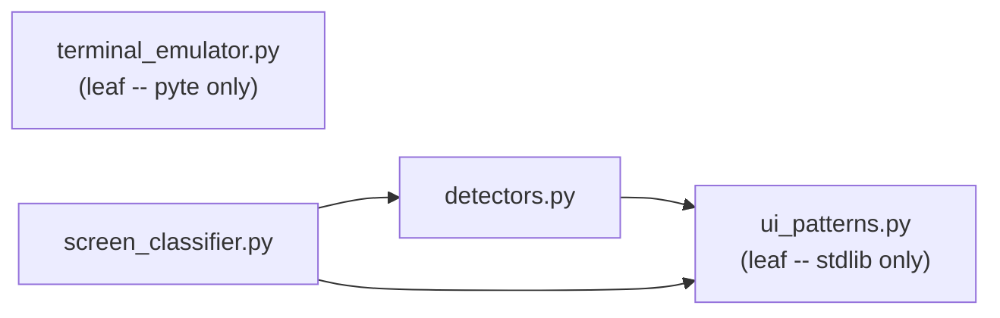

# src/parsing/ -- Terminal Output Parsing Pipeline

Raw PTY bytes flow through this pipeline to produce a structured screen state that downstream modules (output streaming, formatting) can act on.

## Modules

| Module | Purpose |
|---|---|
| `terminal_emulator.py` | pyte-based virtual terminal; feeds raw bytes, exposes `get_display()` (full screen) and `get_changes()` (incremental delta) |
| `ui_patterns.py` | Compiled regex patterns, `classify_text_line()` for 15 line types, `CHROME_CATEGORIES` constant |
| `models.py` | Shared data types: `TerminalView` enum (14 observations), `ScreenEvent` dataclass |
| `content_classifier.py` | ANSI-aware semantic region classifier using pyte character attributes; produces `ContentRegion` objects |
| `detectors.py` | Structured detectors for complex UI elements: tool requests, TODO lists, parallel agents, thinking indicators, background tasks |
| `screen_classifier.py` | `classify_screen_state()` -- 3-pass priority classifier that returns a single `ScreenState` from a full screen grid |

## Dependency Diagram

`terminal_emulator` and `ui_patterns` are leaf modules with no intra-package dependencies. `detectors` imports patterns from `ui_patterns`. `screen_classifier` imports from both `detectors` and `ui_patterns`.

## Key Patterns

- **TerminalView enum (14 observations):** Full-screen classification, not line-by-line. Every poll cycle produces exactly one `TerminalView`.
- **3-pass priority classifier:** Pass 1 scans the whole screen for tool approval menus, TODO lists, and parallel agents. Pass 2 scans the bottom 8 lines for thinking, running tools, and tool results. Pass 3 checks the last line for idle/streaming/user message, with startup/error/unknown as fallbacks.
- **Capture-driven testing:** All parser changes are validated against real terminal snapshots captured from live Claude Code sessions. Zero UNKNOWN classifications across the entire corpus.
- **pyte artifacts:** Trailing U+FFFD on separator lines from partial ANSI sequences; all regexes allow `\uFFFD*$`.
