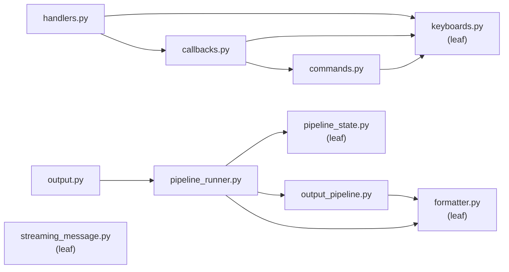

# src/telegram/ -- Telegram Bot Layer

User interaction, output streaming, and message formatting for the Telegram interface. All handlers gate on `is_authorized()` before processing.

## Modules

| Module | Purpose |
|---|---|
| `keyboards.py` | `is_authorized()` gate, `BOT_COMMANDS` list, inline keyboard builders for projects/sessions/tools, history formatting helpers |
| `handlers.py` | Core Telegram handlers: `/start`, `/sessions`, `/exit`, text messages, unknown commands |
| `callbacks.py` | Inline keyboard callback query dispatch and per-prefix handlers (`project:`, `switch:`, `kill:`, `update:`, `tool:`, `page:`) |
| `commands.py` | Extended command handlers: `/history`, `/git`, `/context`, `/download`, `/update_claude`, file uploads |
| `formatter.py` | HTML formatting (`format_html`), text reflowing (`reflow_text`), region rendering (`render_regions`), message splitting for the 4096-char limit |
| `output.py` | `poll_output()` thin loop — dispatches through `PipelineRunner` per session each 300ms cycle |
| `pipeline_state.py` | `PipelinePhase` enum, `PipelineState` per-session state, `mark_tool_acted`/`is_tool_request_pending` helpers |
| `pipeline_runner.py` | `PipelineRunner` transition-table-driven output processor: `(phase, observation) → (next_phase, actions)` |
| `output_pipeline.py` | Content extraction helpers, `render_ansi` rendering, `strip_response_markers`, span manipulation |
| `streaming_message.py` | `StreamingMessage` edit-in-place streaming with throttled edits, overflow handling, `StreamingState` enum |

## Dependency Diagram

`keyboards`, `formatter`, `pipeline_state`, and `streaming_message` are leaf modules. `handlers` delegates callback queries to `callbacks`. `output` is a thin loop that dispatches through `PipelineRunner`. `PipelineRunner` uses a transition table to map `(PipelinePhase, TerminalView)` pairs to actions.

## Key Patterns

- **`is_authorized()` gate:** Every handler checks the user against `config.telegram.authorized_users` before processing. Unauthorized users receive a rejection message.
- **`poll_output()` async loop:** Runs as a background `asyncio.Task`. Each 300ms cycle reads from all active sessions, feeds PTY bytes to the terminal emulator, classifies the screen, and dispatches through `PipelineRunner`.
- **Transition table:** `PipelineRunner` uses a `(PipelinePhase, TerminalView) → (next_phase, actions)` lookup table. Actions are method name suffixes dispatched in order. Per-action error isolation ensures partial failures still advance the phase.
- **`StreamingMessage` edit-in-place:** Manages a single Telegram message that is edited in-place as Claude streams output. State machine: IDLE -> THINKING (typing indicator) -> STREAMING (throttled edits) -> IDLE. Handles overflow by splitting at 4096 chars and starting a new message. Falls back to plain text on HTML parse errors.
