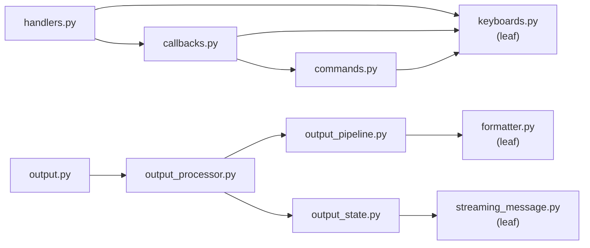

# src/telegram/ -- Telegram Bot Layer

User interaction, output streaming, and message formatting for the Telegram interface. All handlers gate on `is_authorized()` before processing.

## Modules

| Module | Purpose |
|---|---|
| `keyboards.py` | `is_authorized()` gate, `BOT_COMMANDS` list, inline keyboard builders for projects/sessions/tools, history formatting helpers |
| `handlers.py` | Core Telegram handlers: `/start`, `/sessions`, `/exit`, text messages, unknown commands |
| `callbacks.py` | Inline keyboard callback query dispatch and per-prefix handlers (`project:`, `switch:`, `kill:`, `update:`, `tool:`, `page:`) |
| `commands.py` | Extended command handlers: `/history`, `/git`, `/context`, `/download`, `/update_claude`, file uploads |
| `formatter.py` | HTML formatting (`format_html`), heuristic code-block detection (`wrap_code_blocks`), text reflowing (`reflow_text`), message splitting for the 4096-char limit |
| `output.py` | `poll_output()` thin loop — delegates to `SessionProcessor` per session each 300ms cycle; backward-compat bridge for legacy test dicts |
| `output_state.py` | `SessionOutputState` per-session state, `ContentDeduplicator`, registry functions |
| `output_processor.py` | `SessionProcessor` 3-phase cycle (pre-extraction → extraction → finalization), `ExtractionMode` enum |
| `output_pipeline.py` | Content extraction helpers, `render_heuristic` / `render_ansi` rendering, span manipulation |
| `streaming_message.py` | `StreamingMessage` edit-in-place streaming with throttled edits, overflow handling, `StreamingState` enum |

## Dependency Diagram

`keyboards`, `formatter`, and `streaming_message` are leaf modules. `handlers` delegates callback queries to `callbacks`. `output` is a thin loop that delegates to `output_processor` (3-phase cycle). `output_processor` uses `output_pipeline` for content extraction/rendering and `output_state` for per-session state.

## Key Patterns

- **`is_authorized()` gate:** Every handler checks the user against `config.telegram.authorized_users` before processing. Unauthorized users receive a rejection message.
- **`poll_output()` async loop:** Runs as a background `asyncio.Task`. Each cycle reads from all active sessions, classifies the screen state, extracts content via `_CONTENT_STATES` filtering, converts to HTML via `format_html()`, and streams to Telegram via `StreamingMessage` (edit-in-place).
- **`_CONTENT_STATES` filtering:** Only screen states that produce user-visible output (STREAMING, TOOL_REQUEST, TOOL_RUNNING, TOOL_RESULT, ERROR, TODO_LIST, PARALLEL_AGENTS, BACKGROUND_TASK) are forwarded to Telegram. UI chrome states (STARTUP, IDLE, USER_MESSAGE, UNKNOWN) are suppressed.
- **`StreamingMessage` edit-in-place:** Manages a single Telegram message that is edited in-place as Claude streams output. State machine: IDLE -> THINKING (typing indicator) -> STREAMING (throttled edits) -> IDLE. Handles overflow by splitting at 4096 chars and starting a new message. Falls back to plain text on HTML parse errors.
